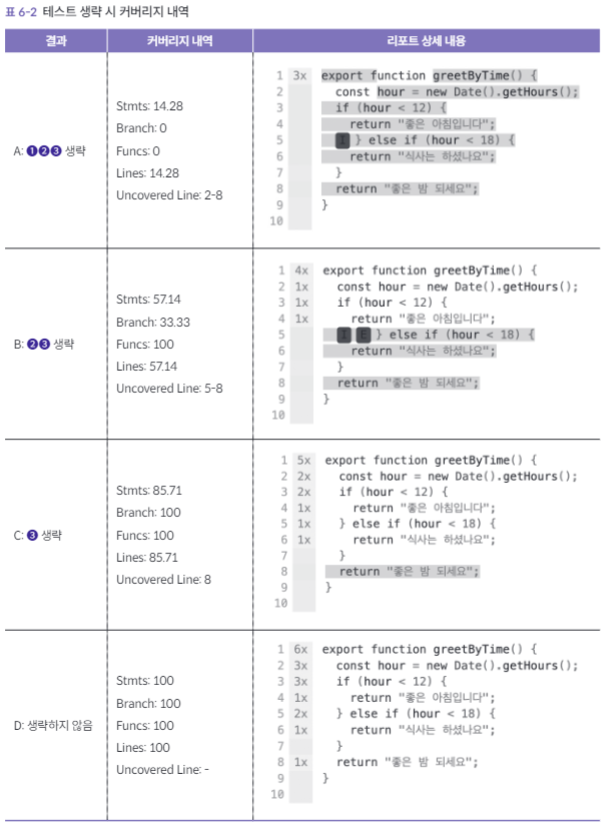

# [6장] 커버리지 리포트 읽기


## 6.1 커버리지 리포트 개요
테스트 프레임 워크에 테스트가 얼마나 진행된지 측정하여 리포트를 작성하는 기능을 제공합니다.
해당 리포트를 `커버리지 리포트`라고 하보 `Jest`에서도 공식적으로 기능을 지원합니다.

### 6.1.1 커버리지 리포트 출력하기
`--coverage` 옵션을 추가해 테스트를 실행하면 커버리지 리포트를 확인할 수 있습니다.
```Bash
$ npx jest --coverage
```

### 6.1.2 커버리지 리포트 구성
Jest의 커버리지 리포트는 테스트를 실행했을 때 각 요소의 호출 여부를 백분율로 나타냅니다.

| File  | stmts   | Branch | Funcs   | Lines   | UncoveredLine | 
|-------|---------|--------|---------|---------|---------------|
| 파일명 | 구문 커버리지 | 분기 커버리지 | 함수 커버리지 | 라인 커버리지 | 커버되지 않은 라인    |

### 6.1.3 Stmts(구문 커버리지)
- 적어도 한번 실행됐는지 나타냅니다.

### 6.1.4 Branch(분기 커버리지)
- 모든 조건 분기가 적어도 한 번은 실행됐는지 나타냅니다. (`if` `case` `삼항연산자`가 측정대상)

### 6.1.5 Funcs(함수 커버리지)
- 모든 함수가 적어도 한 번은 호출됐는지 나타냅니다. `export`된 함수를 찾습니다.

### 6.1.6 Lines(라인 커버리지)
- 모든 라인이 적어도 한 번은 통과됐는지 나타냅니다.

## 6.2 커버리지 리포트 읽기
Jest는CLI에서 리포트를 확인할 수 있을 뿐 아니라 HTML로 리포트를 생성하는 기능을 제공합니다.
`jest.config.ts`에 아래 설정을 추가하면 리포트가 자동 생성됩니다.(`coverageDirectory`에 리포트를 생성할 임의의 디렉터리 명을 입력합니다.)

```ts
export default {
    // 생략
    collectCoverage: true,
    coverageDirectory: "coverage",
}
```
테스트 실행 후 open(window를 사용한다면 start) `coverage/lcov-report/index.html`를 실행하면 각 커버리지 요약 정보와 테스트 실시간 파일 목록을 브라우저로 제공한다.


### 6.2.1 함수의 테스트 커버리지 
```ts
export function greetByTime() {
  const hour = new Date().getHours();
  if (hour < 12) {
    return "좋은 아침입니다";
  } else if (hour < 18) {
    return "식사는 하셨나요";
  }
  return "좋은 밤 되세요";
}
```

`test`는 맨 앞에 `x`를 붙여서 `xtest`로 만들면 실행을 생략 가능하다.
```ts
import { greetByTime } from "./greetByTime";

describe("greetByTime(", () => {
  beforeEach(() => {
    jest.useFakeTimers();
  });
  afterEach(() => {
    jest.useRealTimers();
  });
  // (1) '좋은 아침입니다'를 반환하는 함수
  test("아침에는 '좋은 아침입니다'를 반환한다", () => {
    jest.setSystemTime(new Date(2023, 4, 23, 8, 0, 0));
    expect(greetByTime()).toBe("좋은 아침입니다");
  });
  // (2) '식사는 하셨나요'를 반환하는 함수
  xtest("점심에는 '식사는 하셨나요'를 반환한다", () => {
    jest.setSystemTime(new Date(2023, 4, 23, 14, 0, 0));
    expect(greetByTime()).toBe("식사는 하셨나요");
  });
  // (3) '좋은 밤되세요'를 반환하는 함수
  xtest("저녁에는 '좋은 밤 되세요'를 반환한다", () => {
    jest.setSystemTime(new Date(2023, 4, 23, 21, 0, 0));
    expect(greetByTime()).toBe("좋은 밤 되세요");
  });
});

```
각 테스트의 생략한 결과를 비교하여 표로 나타낸 것 입니다.
결과를 보면 커버되지 않은 라인이 회색으로 칠해진 것을 확인할 수 있다.


### 6.2.2 UI 컴포넌트의 테스트 커버리지
`JSX`도 하나의 함수이므로 구문 커버리지와 분기 커버리지를 측정할 수 있다.

```tsx
type Props = {
  items: { id: number; title: string }[];
  isLoading?: boolean;
};
export const Articles = ({ items, isLoading }: Props) => {
  if (isLoading) {
    return <p>...loading</p>;
  }
  return (
    <div>
      <h2>기사 목록</h2>
      {items.length ? (
        <ul>
          {items.map((item) => (
            <li key={item.id}>
              <a href={`/articles/${item.id}`}>{item.title}</a>
            </li>
          ))}
        </ul>
      ) : (
        <p>게재된 기사가 없습니다</p>
      )}
    </div>
  );
};
```

위 컴포넌트로 테스트를 작성
```tsx
import { render, screen } from "@testing-library/react";
import { Articles } from "./Articles";

test("목록에 표시할 데이터가 있으면 목록이 표시된다", () => {
  const items = [
    { id: 1, title: "Testing Next.js" },
    { id: 2, title: "Storybook play function" },
    { id: 3, title: "Visual Regression Testing " },
  ];
  render(<Articles items={items} isLoading={false} />);
  expect(screen.getByRole("list")).toBeInTheDocument();
});
```

위 테스트를 돌리면 실행되지 않은 분기 라인이 강조됩니다. 로딩중인 상태의 테스트가 부족함을 알 수 있습니다.


위에서 발견한 문제를 통과되도록 추가합니다.

```tsx
import { render, screen } from "@testing-library/react";
import { Articles } from "./Articles";

xtest("데이터를 불러오는 중이면 '..loading'을 표시한다", () => {
  render(<Articles items={[]} isLoading={true} />);
  expect(screen.getByText("...loading")).toBeInTheDocument();
});

xtest("목록이 비어 있으면 '게재된 기사가 없습니다'를 표시한다", () => {
  render(<Articles items={[]} isLoading={false} />);
  expect(screen.getByText("게재된 기사가 없습니다")).toBeInTheDocument();
});

test("목록에 표시할 데이터가 있으면 목록이 표시된다", () => {
  const items = [
    { id: 1, title: "Testing Next.js" },
    { id: 2, title: "Storybook play function" },
    { id: 3, title: "Visual Regression Testing " },
  ];
  render(<Articles items={items} isLoading={false} />);
  expect(screen.getByRole("list")).toBeInTheDocument();
});
```

커버리지는 객관적인 측정이 가능한 정량 지표 이며, 분기 커버리지가 80% 이상이 아니면 CI를 통과하지 못한다 같은 파이프 라인을 만드는데 활용이 가능하다.
하지만 수치가 높다고 반드시 품질이 높고 버그가 없다는 것이 아니다. 다만 커버리지가 낮은건 테스트가 부족하다는 신호이다.

## 6.3 커스텀 리포터
테스트 실행 결과는 여러 리포트를 통해 확인 가능합니다.
`jest.confit.ts`에 선호하는 리포트를 추가 하여 테스트 환경을 견고하게 할 수 있습니다.

```ts
export default {
  // 생략
  reporters: [
    "default",
    [
      "jest-html-reporters",
      {
        publicPath: "__reports__",
        filename: "jest.html",
      },
    ],
  ],
};
```

### 6.3.1 jest-html-reporters

테스트 실행 결과를 그래프 형태로 보여줍니다. `시간이 많이 걸리는 테스트`를 찾거나 `정렬 기능`이 있어 편리합니다.


### 6.3.2 그 밖의 리포터

전체 결과를 분석하는 데 용이한 jest-html-reporters 외에도 깃허브에는 테스트가 실패한 부분에 코멘트를 남기는 등 특색 있는 기능을 가진 리포트가 많습니다.
`https://github.com/jest-community/awesome-jest/blob/main/README.md#reporters`