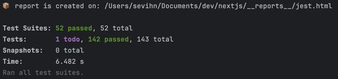
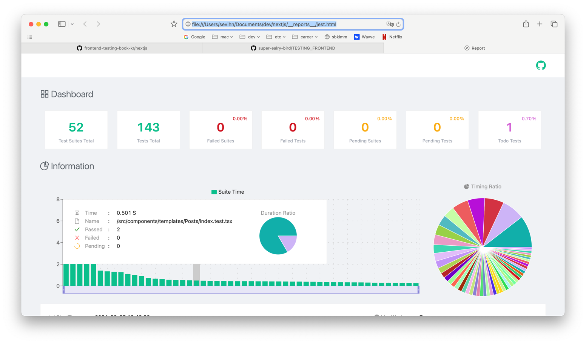

# Chapter 7. 웹 애플리케이션 통합 테스트
## 7.1 Next.js 애플리케이션 개발과 통합 테스트
> 7장부터는 아래 저장소에 있는 Next.js 애플리케이션을 예제로 사용한다.
> <br/> https://github.com/frontend-testing-book-kr/nextjs

### 7.1.1 애플리케이션 개요

* 기술 관련 기사를 작성하고 공유하는 애플리케이션

### 7.1.2 단위 테스트 및 통합 테스트 실행하기

위의 저장소를 클론하고 단위 테스트와 통합 테스트 실행하기

```shell
$ npm i
$ npm test
$ open __reports__/jest.html
```
📝 테스트 실행결과



📊 리포트


<br/>

## 7.2 React Context와 통합 테스트

### 7.2.1 테스트할 UI 컴포넌트

* `<Toast />` 컴포넌트
  * 애플리케이션의 응답 결과를 통지하는 컴포넌트
  * 모든 화면에서 호출할 수 있는 전역 UI
 
  

<br />

Toast 컴포넌트와 같은 전역 UI를 다룰 때 사용하는 기술 **Context API**

> 💡 Context API란?
> 
> Props로 값을 전달할 필요 없이 하위 컴포넌트에서 최상위 컴포넌트가 소유한 값과 갱신 함수에 접근 가능하게 하는 리액트 공식 API


**[ Context API 사용법 ]**

1. `<Toast />` 컴포넌트의 렌더링을 결정하는 상태의 초깃값 세팅
```ts
export const initialState: ToastState = {
  isShown: false,
  message: "",
  style: "succeed",
};
```

2. createContext API 를 사용해 `Context` 생성
```ts
export const ToastStateContext = createContext(initialState);
export const ToastActionContext = createContext(initialAction);
```
* ToastStateContext : 상태를 소유할 Context
* ToastActionContext : 상태 갱신 함수를 소유할 Context

3. 최상위 컴포넌트 `ToastProvider` 렌더링

```ts
export const ToastProvider = ({
  children,
  defaultState,
}: {
  children: ReactNode;
  defaultState?: Partial<ToastState>;
}) => {
  const { isShown, message, style, showToast, hideToast } =
    useToastProvider(defaultState);
  return (
    {/* 하위 컴포넌트에서 isShown, message, style을 참조할 수 있다 */}
    <ToastStateContext.Provider value={{ isShown, message, style }}>
      {/* 하위 컴포넌트에서 showToast, hideToast를 참조할 수 있다 */}
      <ToastActionContext.Provider value={{ showToast, hideToast }}>
        {children}
        {/* isShown이 true가 되면 표시된다 */}
        {isShown && <Toast message={message} style={style} />}
      </ToastActionContext.Provider>
    </ToastStateContext.Provider>
  );
};
```
* 2에서 생성한 `Context` 객체가 소유한 `Provide` 컴포넌트를 렌더링
* ToastProvider로 감싸면 하위 컴포넌트 `children`에서 상태와 상태 갱신 함수에 접근 가능
 
4. 하위 컴포넌트에서 사용하기
```ts
import { useContext } from "react";
import { ToastActionContext } from "./ToastContext";

export function useToastAction() {
  return useContext(ToastActionContext);
}
```
```ts
const { showToast } = useToastAction();
const onSubmit = handleSubmit(async (input) => {
  try {
    // ... 웹 API에 값을 전송한다.
    showToast({ message: "저장됐습니다.", style: "succeed" });
  } catch (err) {
    showToast({ message: "저장에 실패했습니다.", style: "failed" });
  }
});
```
* 하위 컴포넌트에서는 `useContext`를 사용해 접근
* 예제에서는 custom hooks로 만들어서 중복된 코드 사용 ⬇️

Toast 컴포넌트와 같은 전역 UI를 대상으로 실시하는 테스트는 다음과 같은 사항을 중점으로 둔다.

>- `Provider`의 상태에 따라 렌더링 여부가 변경된다.
>- `Provider`의 갱신 함수로 상태를 갱신할 수 있다.


<br />

### 7.2.2 방법① 테스트용 컴포넌트를 만들어 인터랙션 실행하기

전역 UI를 대상으로 Context를 테스트하는 첫 번째 방법 : **테스트용 컴포넌트 만들기**

* 테스트 컴포넌트
```ts
const TestComponent = ({ message }: { message: string }) => {
  const { showToast } = useToastAction(); // <Toast>를 표시하기 위한 훅
  return <button onClick={() => showToast({ message })}>show</button>;
};
```

* 테스트 코드
```ts
test("showToast를 호출하면 Toast컴포넌트가 표시된다", async () => {
  const message = "test";
  // 1. Provider와 테스트 컴포넌트 렌더링
  render(
    <ToastProvider>
      <TestComponent message={message} />
    </ToastProvider>
  );
  // 2. 처음에는 렌더링되지 않음을 테스트
  expect(screen.queryByRole("alert")).not.toBeInTheDocument();
  // 3. 클릭 이벤트 발생
  await user.click(screen.getByRole("button"));
  // 4. 렌더링됐는지 테스트
  expect(screen.getByRole("alert")).toHaveTextContent(message);
});
```

<br/>

### 7.2.3 방법② 초깃값을 주입해서 렌더링된 내용 확인하기

전역 UI를 대상으로 Context를 테스트하는 두 번째 방법 : **초깃값 주입** \
단순히 렌더링 여부를 확인하고 싶을 때 사용 (초깃값을 설정할 수 있도록 구현 필요)

* 테스트 코드
```ts
test("Succeed", () => {
  const state: ToastState = {
    isShown: true,
    message: "성공했습니다",
    style: "succeed",
  };
  render(<ToastProvider defaultState={state}>{null}</ToastProvider>);
  expect(screen.getByRole("alert")).toHaveTextContent(state.message);
});

test("Failed", () => {
  const state: ToastState = {
    isShown: true,
    message: "실패했습니다",
    style: "failed",
  };
  render(<ToastProvider defaultState={state}>{null}</ToastProvider>);
  expect(screen.getByRole("alert")).toHaveTextContent(state.message);
});
```

> 💡 초깃값을 주입하는 두 번째 방법보다는 Toast 컴포넌트를 렌더링하고 조작하는 데 필요한 아래 네 가지 모듈을 모두 테스트할 수 있는 첫 번째 방법이 더 넓은 범위의 통합 테스트이다.
> * `Toast` : view 제공 및 테스트할 컴포넌트
> * `ToastProvider` : 렌더링 여부를 결정할 상태를 소유
> * `useToastProvider` : 렌더링 관련 로직을 관리 
> * `useToastAction, useToastState` : 하위 컴포넌트에서 호출하는 hooks

<br/>

## 7.3 Next.js 라우터와 렌더링 통합 테스트

### 7.3.1 테스트할 UI 컴포넌트

* `<Nav />` 컴포넌트
  * 헤더 내비게이셔을 담당하는 UI 컴포넌트
  * URL에 따라 내비게이션 메뉴에 현재 위치를 나타냄


<br />

### 7.3.2 UI 컴포넌트 구현

Nav 컴포넌트는 a태그에 `aria-current` 라는 속성을 사용해서 스타일을 적용하고 있다.
```html
<a aria-current="page">Create Post</a>
```

```css
.list a[aria-current="page"] {
  border-color: var(--orange);
}
```
`aria-current` 속성을 가지는 마크업을 출력하기 위해 사용하는 isCurrent 함수

```ts
function isCurrent(flag: boolean): AnchorHTMLAttributes<HTMLAnchorElement> {
  if (!flag) return {};
  return { "aria-current": "page" };
}
```

```ts
<a {...isCurrent(pathname === "/my/posts/create")}>Create Post</a>
```
현재 URL 정보인 pathname을 가져오기 위해서 Next.js의 useRouter 훅을 사용
```ts
const { pathname } = useRouter();
```
***위와 같이 Next.js의 라우터와 관련된 컴포넌트를 테스트하려면 목 객체가 필요!***

<br />

### 7.3.3 next-router-mock 설치

> 💡 next-router-mock 이란?
>
> 제스트에서 Next.js의 라우터를 테스트할 수 있도록 목 객체를 제공하는 라이브러리

```shell
$ npm install --save-dev next-router-mock
```

<br />

### 7.3.4 라우터와 UI 컴포넌트 통합 테스트
`next-router-mock`을 사용해 테스트 코드를 작성
* 테스트 코드
```ts
test("현재 위치는 'My Posts'이다", () => {
  // 1. setCurrentUrl를 사용해 테스트 환경의 URL 설정
  mockRouter.setCurrentUrl("/my/posts");
  // 2. 테스트 대상인 Nav 컴포넌트 렌더링
  render(<Nav onCloseMenu={() => {}} />);
  // 3. aria-current 속성을 검증해 테스트
  const link = screen.getByRole("link", { name: "My Posts" });
  expect(link).toHaveAttribute("aria-current", "page");
});
```

<br />

### 7.3.5 test.each 활용

* 동일한 테스트를 매개변수만 변경해 반복하고 싶은 경우 -> `test.each` 활용

```ts
test.each([
  { url: "/my/posts", name: "My Posts" },
  { url: "/my/posts/123", name: "My Posts" },
  { url: "/my/posts/create", name: "Create Post" },
])("$url의 현재 위치는 $name이다", ({ url, name }) => {
  mockRouter.setCurrentUrl(url);
  render(<Nav onCloseMenu={() => {}} />);
  const link = screen.getByRole("link", { name });
  expect(link).toHaveAttribute("aria-current", "page");
});
```

> 💡Next.js 13버전에는 라우터 구조가 크게 변경된 app directory가 탑재되었다. 예제는 Next.js 12의 pages directory를 기반으로 작성되어 있다.

<br />

## 7.4 Next.js 라우터와 입력 통합 테스트

### 7.4.1 테스트할 UI 컴포넌트

* `<Header />` 컴포넌트
  * 기사 목록의 헤더 컴포넌트
  * select 버튼으로 라우터를 조작해 URL 매개변수를 변경
    


<br />

### 7.4.2 초기 화면 테스트

UI 컴포넌트의 통합 테스트에 앞서 아래와 같은 설정 함수를 사용하면 모든 테스트에서 필요한 설정을 한 곳에서 간편하게 처리할 수 있다.
* 설정 함수
  * 테스트 컴포넌트 렌더링
  * 요소 취득 및 반환
  * URL 설정 등..
```ts
function setup(url = "/my/posts?page=1") {
  mockRouter.setCurrentUrl(url);
  render(<Header />);
  const combobox = screen.getByRole("combobox", { name: "공개 여부" });
  return { combobox };
}
```

* 설정 함수를 활용해서 작성한 테스트 코드
```ts
test("기본값으로 '모두'가 선택되어 있다", async () => {
  const { combobox } = setup();
  expect(combobox).toHaveDisplayValue("모두");
});

test("status?=public으로 접속하면 '공개'가 선택되어 있다", async () => {
  const { combobox } = setup("/my/posts?status=public");
  expect(combobox).toHaveDisplayValue("공개");
});

test("staus?=private으로 접속하면 '비공개'가 선택되어 있다", async () => {
  const { combobox } = setup("/my/posts?status=private");
  expect(combobox).toHaveDisplayValue("비공개");
});
```

<br />

### 7.4.3 인터랙션 테스트
인터랙션 테스트를 위해 설정 함수에 userEvent를 활용한 인터랙션 함수 추가
* 설정 함수
```ts
const user = userEvent.setup();

function setup(url = "/my/posts?page=1") {
  mockRouter.setCurrentUrl(url);
  render(<Header />);
  const combobox = screen.getByRole("combobox", { name: "공개 여부" });
  async function selectOption(label: string) {
    await user.selectOptions(combobox, label);
  }
  return { combobox, selectOption };
}
```
* 테스트 코드
```ts
test("공개 여부를 변경하면 status가 변한다", async () => {
  const { selectOption } = setup();
  expect(mockRouter).toMatchObject({ query: { page: "1" } });
  
  // 1. '공개'를 선택
  await selectOption("공개");
  // 2. 기존의 page=1이 그대로 있는지,status가 public인지 함께 검증
  expect(mockRouter).toMatchObject({
    query: { page: "1", status: "public" },
  });
  
  // 3. '비공개'를 선택
  await selectOption("비공개");
  // 4. 기존의 page=1이 그대로 있는지,status가 private인지 함께 검증
  expect(mockRouter).toMatchObject({
    query: { page: "1", status: "private" },
  });
});
```

<br />

## 7.5 React Hook Form으로 폼 쉽게 다루기
> 💡 React Hook Form 이란 ?
> 
> 폼 상태와 유효성 검사를 처리하기 위한 간편한 방법을 제공하는 리액트 기반의 폼 관리 라이브러리
### 7.5.1 제어 컴포넌트
* 제어 컴포넌트 (Controlled Component)
  * useState 등을 사용해 컴포넌트 단위로 상태를 관리하는 컴포넌트
* 제어 컴포넌트를 활용한 폼의 흐름 
  1. useState를 사용해 입력 요소의 값을 저장할 `상태 생성`
  2. onChange 이벤트 핸들러로 `상태 갱신`
  3. 갱신된 값이 입력 요소에 `반영`
  ```ts
  const [ value, setValue ] = useState("");
  return (
    <input
      type="search"
      value={value}
      onChange={(event) => {
        setValue(event.currentTarget.value);
      }}
    />
  );
  ```

<br />  

### 7.5.2 비제어 컴포넌트
* 비제어 컴포넌트 (Uncontrolled Component)
  * 폼을 전송할 때 입력 요소에 브라우저 고유 기능을 사용해 값을 참조하도록 구현
  * `ref`를 통해 DOM의 값을 참조
  * DOM의 값을 참조하기 때문에 value, onChange를 지정하지 않음
  ```ts
  const ref = useRef<HTMLInputElement>(null);
  return <input type="search" name="search" defaultValue="" ref={ref} />
  ```

<br />

### 7.5.3 React Hook Form과 비제어 컴포넌트
React Hook Form은 비제어 컴포넌트로 고성능 폼을 쉽게 작성할 수 있도록 도와주는 라이브러리로 ref나 이벤트 핸들러를 자동으로 생성하고 설정해준다.
React Hook Form을 적용하려면 Form 컴포넌트에 useForm이라는 훅을 사용해야한다.

useForm의 반환값은 `register` 함수와 `handleSubmit` 함수
```ts
const { register, handleSubmit } = useForm({
  defaultValue: { search: q },
})
```
`register` 함수를 호출해 입력 요소의 값을 참조
```ts
<input type="search" {...register("search")} />
```
`handleSubmit` 함수를 활용해 등록된 입력 요소의 값을 취득
```ts
<form 
  onSubmit={handleSubmit((values) => {
    // 입력된 값을 취득
  })}
>
```

[참고] React Hook Form은 제어 컴포넌트로도 구현할 수 있음

<br />

## 7.6 폼 유효성 검사 테스트
### 7.6.1 테스트할 UI 컴포넌트
* `<PostForm />` 컴포넌트
  * 신규 기사 작성 폼을 가진 UI 컴포넌트
  * 폼 전송 전에 유효성 검사 실시
  * React Hook Form을 사용


<br />

### 7.6.2 설계 포인트
* React Hook Form의 `handleSubmit` 함수
  * 두 개의 인수를 받을 수 있음
  * 첫 번째 인수 -> 유효성 검사가 성공했을 때 사용할 이벤트 핸들러 지정
  * 두 번째 인수 -> 유효성 검사 오류가 발생했을 때 사용할 이벤트 핸들러 지정
  * 아래와 같이 Props에서 취득한 이벤트 핸들러도 지정 가능

  ```ts
  export declare type UseFormHandleSubmit<TFieldValues extends FieldValues> 
  = (onValid: SubmitHandler<TFieldValues>, onInvalid?: SubmitErrorHandler<TFieldValues>) => (e?: React.BaseSyntheticEvent) => Promise<void>;
  ```

  ```ts
  <form
    aria-label={props.title}
    className={styles.module}
    onSubmit={handleSubmit(props.onValid, props.onInvalid)}
  >
  ```
  
* `PostForm` 컴포넌트의 책임
  * 입력폼 제공
  * 입력 내용 검증 (유효성 검사)
  * 유효성 검사 오류가 있으면 오류 표시
  * 유효한 내용이 전송되면 onValid 실행
  * 유요하지 않은 내용이 전송되면 onInvalid 실행

<br />

### 7.6.3 인터랙션 테스트 설정
* 설정 함수
```ts
function setup() {
  // 단언문에 사용하기 위한 목 함수들
  const onClickSave = jest.fn();
  const onValid = jest.fn();
  const onInvalid = jest.fn();
  // 컴포넌트 렌더링
  render(
    <PostForm
      title="신규 기사"
      onClickSave={onClickSave}
      onValid={onValid}
      onInvalid={onInvalid}
    />
  );
  // 제목을 입력하는 인터랙션 함수
  async function typeTitle(title: string) {
    const textbox = screen.getByRole("textbox", { name: "제목" });
    await user.type(textbox, title);
  }
  // 기사를 공개하는 인터랙션 함수
  async function saveAsPublished() {
    await user.click(screen.getByRole("switch", { name: "공개 여부" }));
    await user.click(screen.getByRole("button", { name: "공개하기" }));
  }
  // 비공개 상태로 저장하는 인터랙션 함수
  async function saveAsDraft() {
    await user.click(screen.getByRole("button", { name: "비공개 상태로 저장" }));
  }
  return {
    typeTitle,
    saveAsDraft,
    saveAsPublished,
    onClickSave,
    onValid,
    onInvalid,
  };
}
```

<br />

### 7.6.4 onInvalid가 실행되는 테스트
* 테스트 코드 1 : 오류 메시지 검증

```ts
test("유효하지 않은 내용을 포함해 '비공개 상태로 저장'을 시도하면 유효성 검사 에러가 표시된다", async () => {
  // 1. 설정 함수 실행
  const { saveAsDraft } = setup();
  // 2. 비공개 상태로 저장 시도
  await saveAsDraft();
  // 3. 유효성 검사 오류가 나타나는 데 시간이 걸리므로 waitFor로 단언문을 계속 재시도
  await waitFor(() =>
    expect(screen.getByRole("textbox", { name: "제목" }))
      .toHaveErrorMessage("한 글자 이상의 문자를 입력해주세요")
  );
});
```
* 테스트 코드 2 : 이벤트 핸들러 검증
```ts
test("유효하지 않은 내용을 포함해 '비공개 상태로 저장'을 시도하면 onInvalid 이벤트 핸들러가 실행된다", async () => {
  // 1. 설정 함수 실행
  const { saveAsDraft, onClickSave, onValid, onInvalid } = setup();
  // 2. 비공개 상태로 저장 시도 
  await saveAsDraft();
  // 3. 이벤트 핸들러가 실행됐는지 검증
  expect(onClickSave).toHaveBeenCalled();
  expect(onValid).not.toHaveBeenCalled();
  expect(onInvalid).toHaveBeenCalled();
});
```

<br />

### 7.6.5 onValid가 실행되는 테스트
* 테스트 코드
```ts
test("유효한 입력 내용으로 '비공개 상태로 저장'을 시도하면 onValid 이벤트 핸들러가 실행된다", async () => {
  mockUploadImage();
  // 1. 설정 함수 실행
  const { typeTitle, saveAsDraft, onClickSave, onValid, onInvalid } = setup();
  const { selectImage } = selectImageFile();
  // 2. 제목 입력
  await typeTitle("나의 기사");
  await selectImage();
  // 3. 비공개 상태로 저장 시도
  await saveAsDraft();
  // 4. 이벤트 핸들러가 실행됐는지 검증
  expect(onClickSave).toHaveBeenCalled();
  expect(onValid).toHaveBeenCalled();
  expect(onInvalid).not.toHaveBeenCalled();
});
```

<br />


### 7.6.6 TIP: 접근성 관련 매치

* 접근성 관련 매치들
  * `toHaveAccessibleName`
  * `toHaveAccessibleDescription`
  * `toHaveErrorMessage`

```ts
test("TextboxWithInfo", async () => {
  const args = {
    title: "제목",
    info: "0 / 64",
    description: "영문과 숫자를 조합하여 64자 이내로 입력해주세요",
    error: "유효하지 않은 문자가 포함되어 있습니다",
  };
  render(<TextboxWithInfo {...args} />);
  const textbox = screen.getByRole("textbox");
  // label의 htmlFor와 연관돼 있다.
  expect(textbox).toHaveAccessibleName(args.title);
  // aria-describedby와 연관돼 있다.
  expect(textbox).toHaveAccessibleDescription(args.description);
  // aria-errormessage와 연관돼 있다.
  expect(textbox).toHaveErrorMessage(args.error);
});
```
<br />

## 7.7 웹 API 응답을 목 객체화하는 MSW
### 7.7.1 네트워크 계층의 목 객체를 만드는 MSW

> 💡 MSW (Mock Service Worker) 란 ?
>
> 네트워크 계층의 목 객체를 만드는 라이브러리.
> 웹 API를 가로채서 임의의 값으로 만든 응답으로 대체할 수 있기 때문에
> 웹 API를 실행하지 않아도 응답이 오는 상황을 재현할 수 있다.

* 요청 핸들러 (request handler)
  * 웹 API 요청을 가로채기 위한 핸들러
  * 어떤 경로에 대한 요청을 가로챌 것인지 어떤 응답을 반환할 것인지 핸들러에 작성
```ts
import { setupWorker, rest } from "msw";
const worker = setupWorker(
  rest.post("/login", async (req, res, ctx) => {
    const { username } = await req.json();
    return res (
      ctx.json({
        username,
        firstName: "John"
      })
    );
  })
);
```

[참고] MSW는 테스트 시 생성된 요청의 headers나 query의 세부 내용까지 검증할 수 있다.

<br />

### 7.7.2 제스트에서 사용하기

요청 핸들러를 msw의 setupServer함수에 가변 인수로 넘기면 요청을 가로챌 수 있다. \
제스트에서는 설정 함수를 만들어 편리하게 사용할 수 있다.

* 설정 함수
  * setupServer 함수는 테스트마다 서버를 초기화하기 때문에 테스트끼리 영향 X
```ts
export function setupMockServer(...handlers: RequestHandler[]) {
  const server = setupServer(...handlers);
  beforeAll(() => server.listen());
  afterEach(() => server.resetHandlers());
  afterAll(() => server.close());
  return server;
}
```
* 테스트 코드
  * 각 테스트 파일에서 아래와 같이 필요한 핸들러 함수를 넘겨서 MSW 서버를 설정
```ts
import * as MyPosts from "@/services/client/MyPosts/__mock__/msw";
setupMockServer(...MyPosts.handlers);
```

<br />

### 7.7.3 Fetch API의 폴리필

테스트 환경인 jsdom에 Fetch API가 적용되지 않은 버전일 경우 테스트 코드에 Fetch API를 사용하면 문제가 발생할 수 있지만 `whatwg-fetch` 라이브러리를 사용해 해결할 수 있음

* `whatwg-fetch`
  * Fetch API의 폴리필

> 💡 폴리필 (Polyfill) 이란 ?
>
> 브라우저나 JavaScript 환경에서 아직 지원되지 않는 기능을 구현하거나, 특정 기능의 호환성을 제공하기 위해 사용되는 코드 조각\
> 폴리필은 최신 표준(예: 최신 ECMAScript 기능)을 구형 브라우저에서도 사용할 수 있도록 해준다.

<br />

## 7.8 웹 API 통합 테스트
### 7.8.1 테스트할 UI 컴포넌트
* `<MyPostsCreate />` 컴포넌트
  * 신규 기사 작성 폼을 담당하는 UI 컴포넌트
  * 유효성 검사를 통과한 후의 처리를 담당하는 상위 컴포넌트

<br />

### 7.8.2 인터랙션 테스트 설정
* 설정 함수
```ts
async function setup() {
  const { container } = render(<Default />);
  //기사의 메인 이미지를 선택하는 함수
  const { selectImage } = selectImageFile();
  
  // 제목을 입력하는 함수
  async function typeTitle(title: string) {
    const textbox = screen.getByRole("textbox", { name: "제목" });
    await user.type(textbox, title)
  }
  
  //공개 상태로 저장하는 함수
  async function saveAsPublished() {
    await user.click(screen.getByRole("switch", { name: "공개 여부" }));
    await user.click(screen.getByRole("button", { name: "공개하기" }));
    await screen.findByRole("alertdialog");
  }
  
  //비공개 상태로 저장하는 함수
  async function saveAsDraft() {
    await user.click(screen.getByRole("button", { name: "비공개 상태로 저장" }));
  }
  
  //AlertDialog 의 [네] 혹은 [아니오]를 선택하는 함수
  async function clickButton(name: "네" | "아니오") {
    await user.click(screen.getByRole("button", { name }));
  }
  return {
    container,
    typeTitle,
    saveAsPublished,
    saveAsDraft,
    clickButton,
    selectImage,
  };
}
```

<br />

### 7.8.3 AlertDialog 렌더링 테스트
* `AlertDialog`
  * 공개 직전에만 렌더링되는 UI 컴포넌트
  * [네], [아니오]를 선택할 수 있는 컴포넌트
  


* 테스트 코드 1 
```ts
test("공개를 시도하면 AlertDialog가 표시된다", async () => {
  const { typeTitle, saveAsPublished, selectImage } = await setup();
  await typeTitle("201");
  await selectImage();
  await saveAsPublished();
  expect(
    screen.getByText("기사를 공개합니다. 진행하시겠습니까?")
  ).toBeInTheDocument();
});

test("[아니오] 버튼을 누르면 AlertDialog가 사라진다", async () => {
  const { typeTitle, saveAsPublished, clickButton, selectImage } =
    await setup();
  await typeTitle("201");
  await selectImage();
  await saveAsPublished();
  await clickButton("아니오");
  expect(screen.queryByRole("alertdialog")).not.toBeInTheDocument();
});
```
  
* 테스트 코드 2 : 유효하지 않은 내용을 포함할 경우
```ts
  test("유효하지 않은 내용을 포함한 채로 제출하면 AlertDialog가 사라진다", async () => {
  const { saveAsPublished, clickButton, selectImage } = await setup();
  // await typeTitle("201");　제목을 입력하지 않은 상태
  await selectImage();
  await saveAsPublished();
  await clickButton("네");
  // 제목 입력란이 invalid 상태가 된다.
  await waitFor(() =>
          expect(
                  screen.getByRole("textbox", { name: "제목" })
          ).toBeInvalid()
  );
  expect(screen.queryByRole("alertdialog")).not.toBeInTheDocument();
});
```

<br />

### 7.8.4 Toast 렌더링 테스트
* `Toast`
  * 공개 혹은 저장 요청을 시도하면 표시되는 컴포넌트
  * 요청 시도와 요청 성공에 대한 테스트를 각각 작성


* 테스트 코드
```ts
  test("API 통신을 시도하면 '저장 중입니다...'가 표시된다", async () => {
  const { typeTitle, saveAsPublished, clickButton, selectImage } =
          await setup();
  await typeTitle("201");
  await selectImage();
  await saveAsPublished();
  await clickButton("네");
  await waitFor(() =>
          expect(screen.getByRole("alert")).toHaveTextContent("저장 중입니다...")
  );
});

test("공개에 성공하면 '공개됐습니다'가 표시된다", async () => {
  const { typeTitle, saveAsPublished, clickButton, selectImage } =
          await setup();
  await typeTitle("hoge");
  await selectImage();
  await saveAsPublished();
  await clickButton("네");
  await waitFor(() =>
          expect(screen.getByRole("alert")).toHaveTextContent("공개됐습니다")
  );
});
```
* 테스트 코드 3 : 실패 테스트 (핸들러에 실패 케이스 만들기)
```ts
export function handleCreateMyPosts(spy?: jest.Mock<any, any>) {
  return rest.post(path(), async (req, res, ctx) => {
    const data: ApiMyPosts.PostInput = await req.json();
    spy?.({ body: data, headers: req.headers.get("content-type") });
    if (data.title === "500") {
      const err = new HttpError(500).serialize();
      return res(ctx.status(err.status), ctx.json(err));
    }
    return res(ctx.json(createMyPostsData(data.title)));
  });
}

export const handlers = [handleCreateMyPosts()];
```
```ts
setupMockServer(...MyPosts.handlers, ...MyProfile.handlers);
```
```ts
  test("공개에 실패하면 '공개에 실패했습니다'가 표시된다", async () => {
  const { typeTitle, saveAsPublished, clickButton, selectImage } =
          await setup();
  await typeTitle("500");
  await selectImage();
  await saveAsPublished();
  await clickButton("네");
  await waitFor(() =>
          expect(screen.getByRole("alert")).toHaveTextContent("공개에 실패했습니다")
  );
});
```

<br />

### 7.8.5 화면 이동 테스트

* 테스트 코드
```ts
  test("비공개 상태로 저장 시 비공개한 기사 페이지로 이동한다", async () => {
  const { typeTitle, saveAsDraft, selectImage } = await setup();
  await typeTitle("201");
  await selectImage();
  await saveAsDraft();
  await waitFor(() =>
    expect(mockRouter).toMatchObject({ pathname: "/my/posts/201" })
  );
});

test("공개에 성공하면 화면을 이동한다", async () => {
  const { typeTitle, saveAsPublished, clickButton, selectImage } =
          await setup();
  await typeTitle("201");
  await selectImage();
  await saveAsPublished();
  await clickButton("네");
  await waitFor(() =>
    expect(mockRouter).toMatchObject({ pathname: "/my/posts/201" })
  );
});
```

> 💡 상위 컴포넌트는 연동 테스트, 하위 컴포넌트는 유효성 검사 테스트. \
> 이렇게 각 컴포넌트별로 **자신의 책임에만 집중하여 테스트**하면 테스트 목적은 물론 컴포넌트 간 책임도 분명해진다.

<br />

## 7.9 이미지 업로드 통합 테스트
### 7.9.1 테스트할 UI 컴포넌트

* `<Avatar />` 컴포넌트
  * 사용자 아바타의 이미지를 표시하고 변경하는 역할
  * 컴퓨터에 저장된 이미지 업로드
  * 업로드된 이미지 프로필 이미지로 적용
  

* `<InputFileButton />` 컴포넌트
  * 컴퓨터에 저장된 이미지를 선택할 수 있는 컴포넌트
  * `<input type="file">` 요소
 


```ts
<InputFileButton
  buttonProps={{
    children: "이미지 변경하기",
    type: "button",
  }}
  inputProps={{
    "data-testid": "file",
    // png와 jpeg만 허용
    accept: "image/png, image/jpeg",
    onChange: onChangeImage,
  }}
/>
```

<br />

### 7.9.2 이미지 업로드 처리 흐름

1. 이미지 선택
2. onChangeImage 실행
3. 브라우저 API인 `FileReader`로 이미지 취득
4. 이미지 업로드 API 호출
5. AWS가 제공하는 파일 저장소 서비스에 이미지 저장
6. 이미지 업로드가 완료되면 이미지 URL을 프로필 이미지 src로 사용

```ts
  //handleChangeFile은 FileReader로 이미지 취득
  const onChangeImage = handleChangeFile((_, file) => {
  // 취득한 이미지의 내용을 file에 저장한다.
  // uploadImage 함수는 API Route로 구현된 이미지 업로드 API를 호출한다.
  uploadImage({ file })
    .then((data) => {
      const imgPath = `${data.url}/${data.filename}` as PathValue<T, Path<T>>;
      // API 응답에 포함된 이미지 URL을 경로로 지정한다.
      setImageUrl(imgPath);
      setValue(name, imgPath);
      onResolved?.(data);
    })
    .catch(onRejected);
});
```

### 7.9.3 통합 테스트용 목 객체 만들기

* 문제점 
  * jsdom은 브라우저 API를 제공하지 않기 때문에 이미지 선택 및 업로드 API를 사용할 수 없음 
* 해결방안
  * ***목 함수 사용하기***

#### 1. 이미지를 선택하는 목 함수

* 더미 이미지 파일 작성
* 이미지 선택 인터랙션 재현

```ts
export function selectImageFile(
        inputTestId = "file",
        fileName = "hello.png",
        content = "hello"
) {
  // 1. userEvent를 초기화한다.
  const user = userEvent.setup();
  // 2. 더미 이미지 파일을 작성한다.
  const filePath = [`C:\\fakepath\\${fileName}`];
  const file = new File([content], fileName, { type: "image/png" });
  // 3. render한 컴포넌트에서 data-testid="file"인 input을 취득한다.
  const fileInput = screen.getByTestId(inputTestId);
  // 4. user.upload를 실행하면 해당 input은 이미지를 선택한 상태가 된다.
  const selectImage = () => user.upload(fileInput, file);
  return { fileInput, filePath, selectImage };
}
```

#### 2. 이미지 업로드 API를 호출하는 목 함수

* 정해진 응답 반환

```ts
jest.mock("../fetcher");

export function mockUploadImage(status?: ErrorStatus) {
  if (status && status > 299) {
    return jest
      .spyOn(UploadImage, "uploadImage")
      .mockRejectedValueOnce(new HttpError(status).serialize());
  }
  return jest
    .spyOn(UploadImage, "uploadImage")
    // uploadImageData는 정해진 fixture 데이터
    .mockResolvedValueOnce(uploadImageData);
}
```

<br />

### 7.9.4 업로드 성공 테스트

* 테스트 컴포넌트
```ts
function TestComponent() {
  const { register, setValue } = useForm<PutInput>();
  return BasicLayout(
          <Avatar register={register} setValue={setValue} name="imageUrl" />
);
}
```
* 테스트 코드

```ts
test("이미지 업로드에 성공하면 이미지의 src 속성이 변경된다", async () => {
  // 1. 이미지 업로드가 성공하도록 설정한다.
  mockUploadImage();
  // 2. 컴포넌트를 렌더링한다.
  render(<TestComponent />);
  // 3. 이미지의 src 속성이 비었는지 확인한다.
  expect(screen.getByRole("img").getAttribute("src")).toBeFalsy();
  // 4. 이미지를 선택한다.
  const { selectImage } = selectImageFile();
  await selectImage();
  // 5. 이미지의 src 속성이 채워졌는지 확인한다.
  await waitFor(() =>
    expect(screen.getByRole("img").getAttribute("src")).toBeTruthy()
  );
});
```

<br />

### 7.9.5 업로드 실패 테스트

* 테스트 코드

```ts
test("이미지 업로드에 실패하면 경고창이 표시된다", async () => {
  // 1. 이미지 업로드가 실패하도록 설정한다.
  mockUploadImage(500);
  // 2. 컴포넌트를 렌더링한다.
  render(<TestComponent />);
  // 3. 이미지를 선택한다.
  const { selectImage } = selectImageFile();
  await selectImage();
  // 4.지정한 문자열이 포함된 Toast가 나타나는지 검증한다.
  await waitFor(() =>
    expect(screen.getByRole("alert")).toHaveTextContent(
      "이미지 업로드에 실패했습니다"
    )
  );
});
```

