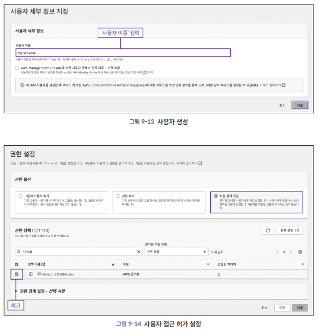

# Chapter 9. 시각적 회귀 테스트
## 9.1 시각적 회귀 테스트의 필요성
> 9장부터는 아래 저장소의 예제를 통해 시각적 회귀 테스트를 다룹니다.
> <br/> https://github.com/frontend-testing-book-kr/vrt

### 9.1.1 스타일 변경 검증의 어려움

* 컴포넌트 기반 개발의 싱글 페이지 어플리케이션은 많은 화면이 수많은 공통 컴포넌트를 공유하기 떄문에 스타일 변경의 여파가 큼

### 9.1.2 시각적 회귀 테서트를 스냅숏 테스트로 대체할 수 있을까

* 스냅숏 테스트는 HTML 출력 결과를 비교함
* 스냅숏 테스트는 **전역에 정의된 스타일의 영향은 알기 어려움**
* 또한, CSS Modules을 사용하면 CSS로 정의한 내용을 알지 못함

### 9.1.3 시각적 회귀 테스트의 선택지

* 가장 기본적인 시각적 회귀 테스트 방법
```
테스트할 화면을 브라우저에 렌더링하고 특정 시점에 캡처한 이미지들을 픽셀 단위로 비교
```
* 시각적 회귀 테스트 단위
```
UI 컴포넌트 
```
* UI 컴포넌트 단위로 실시하면 좋은점
    * 변경 사항을 분명하고 세세하게 검출 가능
    * 컴포넌트 단위로 스토리북을 작성하면 테스트에도 활용 가능

<br/>

## 9.2 reg-cli로 이미지 비교하기

> 💡 reg-cli 란?
>
> 시각적 회귀 테스트 프레임 워크인 reg-suit의 핵심 기능으로 시각적 차이를 비교하고, \
> 그 결과를 CI 파이프라인에 통합할 수 있도록 돕는 도구

### 9.2.1 디렉터리 생성

reg-cli를 사용해서 이미지를 비교하기 위해 필요한 디렉터리 생성

```shell
mkdir vrt && cd vrt
mkdir {actual,expected,diff}
```

* `actual` : 기존 이미지를 저장하는 디렉터리
* `expected` : 비교할 이미지를 저장하는 디렉터리
* `diff` : 비교 결과를 검출한 이미지를 저장하는 디렉터리

<br />

### 9.2.2 새 이미지 검출

* `actual` 폴더에 새로운 이미지를 추가하고 아래 명령어 실행
```shell
npx reg-cli actual expected diff -R(리포트 파일 열기) index.html 
```

* 실행 결과
  이미지 하나를 발견했다는 리포트 출력
```shell
✚ append  actual\sample.png
✚ 1 file(s) appended.
```


### 9.2.3 이미지 간 차이 비교

* `expected` 폴더에 변경점이 있는 이미지 추가하고 아래 명령어 실행
```shell
npx reg-cli actual expected diff -R index.html 
```
* 실행 결과
  이미지 하나를 변경됐다는 리포트 출력
```shell
✘ change  actual\sample.png
✘ 1 file(s) changed.
```


<br />

## 9.3 스토리캡 도입

> 💡 스토리캡(Storycap) 이란?
>
> 스토리북에 등록된 스토리를 캡쳐하는 도구 (별도 설치 필요)

* 스토리캡 설치
```shell
npm install storycap --save-dev
```

### 9.3.1 스토립캡 설정

* .storybook/preview.js 설정
```js
import { withScreentshot } from "storycap";
export const decorators = [withScreenshot];
```

* .storybook/main.js 설정
```js
module.exports = {
    addons: [
        "storycap",
    ],
};
```

### 9.3.2 스토리캡 실행

스토리캡을 실행하기 전에 응답 속도를 빠르게 하기 위해 스토리북 빌드가 필요함

* 스토리북 빌드 스크립트 추가 (package.json)

```json
{
  //생략
  "scripts": {
    "storybook:build": "storybook build",
    "storycap": "storycap --serverCmd \"npx http-server storybook-static -a localhost p 6006\" http://localhost:6006",
  }
}
```

* 스토리캡 실행
```shell
npm run storycap
```

* 스토리캡 실행 결과
    * 캡쳐가 완료된 이미지는 `__screenshots__` 디텍터리에 저장됨
    * `__screenshots__` 를 `expected`로 변경

### 9.3.3 의도적으로 시각적 회귀 테스트 만들기

* 의도적으로 버튼 컴포넌트의 css를 변경
```css
.storybook-button {
  border: 0;
  /* border-radius: 3em; */
  cursor: pointer;
  display: inline-block;
  line-height: 1;
}
```
* 스토리북 빌드 및 스토리캡 실행
```shell
npm run storybook:build
npm run storycap
mv __screenshots__ actual
```

### 9.3.4 reg-cli로 이미지 간 차이 검출하기

위에서 만들어진 expected와 actual 디렉토리와 reg-cli를 사용하여 이미지 간 차이점을 검출

* reg-cli 실행
```shell
npx reg-cli actual expected diff -R index.html
```


<br />

## 9.4 reg-suit 도입하기

시각적 회귀 테스트를 자동화해서 github과 연동 진행


### 9.4.1 reg-suit 도입

* 프로젝트 최상위 경로에서 reg-suit init

```shell
npx reg-suit init
```

* 플러그인 설치
    * 임의의 CI 환경에 reg-suit를 도입시켜주는 편리한 라이브러리들
    * `reg-keygen-git-hash-plugin` : git 해시를 사용하여 비교될 스냅샷 키를 감지
    * `reg-notify-github-plugin` : reg-suit 검증 결과를 github 저장소에 notify
    * `reg-publish-s3-plugin` : 스냅숏과 검증 결과 리포트를 AWS S3에 전송


### 9.4.2 reg-suit 설정 파일 생성

이어서 터미널에 나오는 질문들에 응답하면 reg-suit 설정 파일인 regconfig.json 파일이 생성됨


* reg-notify-github-plugin 질문에 yes를 선택하면 저장소 연동 가능


### 9.4.3 Client ID 취득

위에서 취득한 Client Id는 깃허브 액션의 환경 변수로 설정하여 regconfig.json 파일에 있는 `$REG_NOFITY_CLIENT_ID` 변수 값으로 사용된다.

```json
{
  "core": {
    "workingDir": ".reg",
    "actualDir": "__screenshots__",
    "thresholdRate": 0.03,
    "addIgnore": true,
    "ximgdiff": {
      "invocationType": "client"
    }
  },
  "plugins": {
    "reg-keygen-git-hash-plugin": {},
    "reg-notify-github-plugin": {
      "prComment": true,
      "prCommentBehavior": "default",
      "clientId": "$REG_NOFITY_CLIENT_ID"
    },
    "reg-publish-s3-plugin": {
      "bucketName": "$AWS_BUCKET_NAME"
    }
  }
}
```

### 9.4.4 실제 운영 환경을 고려한 오차 범위 설정

* 실제 운영 환경에 자동화된 시각적 회귀 테스트는 불안정한 테스트로 변질됨

> 💡 불안정한 테스트란?
>
> 코드나 테스트에 변경 사항이 없는데도 상황에 따라 성공하기도 실패하기도 하는 테스트

* 불안정한 테스트가 발견될 경우 -> **_차이점을 검출하는 강도 낮추기_**
* 관련 설정
    * `thresholdRate` : 차이점이 검출된 곳의 픽셀 수를 전체 대비 비율로 계산
    * `thresholdPixel` : 차이점이 검출된 픽셀수의 절댓값

<br />

## 9.5 외부 스토리지 서비스 설정

스냅숏과 검증 결과 리포트를 저장할 외부 스토리지 서비스 설정하기 위해서는 AWS S3에 버킷 생성이 필요

### 9.5.1 버킷 생성

* AWS Management Console에 로그인 및 버킷 생성


* 액세스 설정


### 9.5.2 IAM 사용자 생성

* 버킷에 접근할 IAM 사용자 생성
* 사용자 접근 허가 설정



<br />

## 9.6 깃허브 액선에 reg-suit 연동하기

깃허브 액선과 reg-suit를 연동하면 풀 리퀘스트를 생성할 때마다 자동으로 시각적 회귀 테스트가 실행됨

### 9.6.1 크리덴션을 Actions Secrets에 등록

`#9.4.3` 에서 취득한 ClientId를 저장소의 Actions Secrets에 설정

### 9.6.2 깃허브 액션 설정


### 9.6.3 연동 확인


<br />


## 9.7 시각적 회귀 테스트를 활용한 적극적 리팩터링


### 9.7.1 반응형 디자인에 활용하기


### 9.7.2 릴리스 직전의 리팩터링에 활용하기


### 9.7.3 스토리 커밋 습관화로 시작하는 시각적 회귀 테스트
# Chapter 9. 시각적 회귀 테스트
## 9.1 시각적 회귀 테스트의 필요성
> 9장부터는 아래 저장소의 예제를 통해 시각적 회귀 테스트를 다룹니다.
> <br/> https://github.com/frontend-testing-book-kr/vrt

### 9.1.1 스타일 변경 검증의 어려움

* 컴포넌트 기반 개발의 싱글 페이지 어플리케이션은 많은 화면이 수많은 공통 컴포넌트를 공유하기 떄문에 스타일 변경의 여파가 큼

### 9.1.2 시각적 회귀 테서트를 스냅숏 테스트로 대체할 수 있을까

* 스냅숏 테스트는 HTML 출력 결과를 비교함
* 스냅숏 테스트는 **전역에 정의된 스타일의 영향은 알기 어려움**
* 또한, CSS Modules을 사용하면 CSS로 정의한 내용을 알지 못함

### 9.1.3 시각적 회귀 테스트의 선택지

* 가장 기본적인 시각적 회귀 테스트 방법
```
테스트할 화면을 브라우저에 렌더링하고 특정 시점에 캡처한 이미지들을 픽셀 단위로 비교
```
* 시각적 회귀 테스트 단위
```
UI 컴포넌트 
```
* UI 컴포넌트 단위로 실시하면 좋은점
    * 변경 사항을 분명하고 세세하게 검출 가능
    * 컴포넌트 단위로 스토리북을 작성하면 테스트에도 활용 가능

<br/>

## 9.2 reg-cli로 이미지 비교하기

> 💡 reg-cli 란?
>
> 시각적 회귀 테스트 프레임 워크인 reg-suit의 핵심 기능으로 시각적 차이를 비교하고, \
> 그 결과를 CI 파이프라인에 통합할 수 있도록 돕는 도구

### 9.2.1 디렉터리 생성

reg-cli를 사용해서 이미지를 비교하기 위해 필요한 디렉터리 생성

```shell
mkdir vrt && cd vrt
mkdir {actual,expected,diff}
```

* `actual` : 기존 이미지를 저장하는 디렉터리
* `expected` : 비교할 이미지를 저장하는 디렉터리
* `diff` : 비교 결과를 검출한 이미지를 저장하는 디렉터리

<br />

### 9.2.2 새 이미지 검출

* `actual` 폴더에 새로운 이미지를 추가하고 아래 명령어 실행
```shell
npx reg-cli actual expected diff -R(리포트 파일 열기) index.html 
```

* 실행 결과
  이미지 하나를 발견했다는 리포트 출력
```shell
✚ append  actual\sample.png
✚ 1 file(s) appended.
```


### 9.2.3 이미지 간 차이 비교

* `expected` 폴더에 변경점이 있는 이미지 추가하고 아래 명령어 실행
```shell
npx reg-cli actual expected diff -R index.html 
```
* 실행 결과
  이미지 하나를 변경됐다는 리포트 출력
```shell
✘ change  actual\sample.png
✘ 1 file(s) changed.
```


<br />

## 9.3 스토리캡 도입

> 💡 스토리캡(Storycap) 이란?
>
> 스토리북에 등록된 스토리를 캡쳐하는 도구 (별도 설치 필요)

* 스토리캡 설치
```shell
npm install storycap --save-dev
```

### 9.3.1 스토립캡 설정

* .storybook/preview.js 설정
```js
import { withScreentshot } from "storycap";
export const decorators = [withScreenshot];
```

* .storybook/main.js 설정
```js
module.exports = {
    addons: [
        "storycap",
    ],
};
```

### 9.3.2 스토리캡 실행

스토리캡을 실행하기 전에 응답 속도를 빠르게 하기 위해 스토리북 빌드가 필요함

* 스토리북 빌드 스크립트 추가 (package.json)

```json
{
  //생략
  "scripts": {
    "storybook:build": "storybook build",
    "storycap": "storycap --serverCmd \"npx http-server storybook-static -a localhost p 6006\" http://localhost:6006",
  }
}
```

* 스토리캡 실행
```shell
npm run storycap
```

* 스토리캡 실행 결과
    * 캡쳐가 완료된 이미지는 `__screenshots__` 디텍터리에 저장됨
    * `__screenshots__` 를 `expected`로 변경

### 9.3.3 의도적으로 시각적 회귀 테스트 만들기

* 의도적으로 버튼 컴포넌트의 css를 변경
```css
.storybook-button {
  border: 0;
  /* border-radius: 3em; */
  cursor: pointer;
  display: inline-block;
  line-height: 1;
}
```
* 스토리북 빌드 및 스토리캡 실행
```shell
npm run storybook:build
npm run storycap
mv __screenshots__ actual
```

### 9.3.4 reg-cli로 이미지 간 차이 검출하기

위에서 만들어진 expected와 actual 디렉토리와 reg-cli를 사용하여 이미지 간 차이점을 검출

* reg-cli 실행
```shell
npx reg-cli actual expected diff -R index.html
```


<br />

## 9.4 reg-suit 도입하기

시각적 회귀 테스트를 자동화해서 github과 연동 진행


### 9.4.1 reg-suit 도입

* 프로젝트 최상위 경로에서 reg-suit init

```shell
npx reg-suit init
```

* 플러그인 설치
    * 임의의 CI 환경에 reg-suit를 도입시켜주는 편리한 라이브러리들
    * `reg-keygen-git-hash-plugin` : git 해시를 사용하여 비교될 스냅샷 키를 감지
    * `reg-notify-github-plugin` : reg-suit 검증 결과를 github 저장소에 notify
    * `reg-publish-s3-plugin` : 스냅숏과 검증 결과 리포트를 AWS S3에 전송


### 9.4.2 reg-suit 설정 파일 생성

이어서 터미널에 나오는 질문들에 응답하면 reg-suit 설정 파일인 regconfig.json 파일이 생성됨


* reg-notify-github-plugin 질문에 yes를 선택하면 저장소 연동 가능


### 9.4.3 Client ID 취득

위에서 취득한 Client Id는 깃허브 액션의 환경 변수로 설정하여 regconfig.json 파일에 있는 `$REG_NOFITY_CLIENT_ID` 변수 값으로 사용된다.

```json
{
  "core": {
    "workingDir": ".reg",
    "actualDir": "__screenshots__",
    "thresholdRate": 0.03,
    "addIgnore": true,
    "ximgdiff": {
      "invocationType": "client"
    }
  },
  "plugins": {
    "reg-keygen-git-hash-plugin": {},
    "reg-notify-github-plugin": {
      "prComment": true,
      "prCommentBehavior": "default",
      "clientId": "$REG_NOFITY_CLIENT_ID"
    },
    "reg-publish-s3-plugin": {
      "bucketName": "$AWS_BUCKET_NAME"
    }
  }
}
```

### 9.4.4 실제 운영 환경을 고려한 오차 범위 설정

* 실제 운영 환경에 자동화된 시각적 회귀 테스트는 불안정한 테스트로 변질됨

> 💡 불안정한 테스트란?
>
> 코드나 테스트에 변경 사항이 없는데도 상황에 따라 성공하기도 실패하기도 하는 테스트

* 불안정한 테스트가 발견될 경우 -> **_차이점을 검출하는 강도 낮추기_**
* 관련 설정
    * `thresholdRate` : 차이점이 검출된 곳의 픽셀 수를 전체 대비 비율로 계산
    * `thresholdPixel` : 차이점이 검출된 픽셀수의 절댓값

<br />

## 9.5 외부 스토리지 서비스 설정

스냅숏과 검증 결과 리포트를 저장할 외부 스토리지 서비스 설정하기 위해서는 AWS S3에 버킷 생성이 필요

### 9.5.1 버킷 생성

* AWS Management Console에 로그인 및 버킷 생성


* 액세스 설정


### 9.5.2 IAM 사용자 생성

* 버킷에 접근할 IAM 사용자 생성
* 사용자 접근 허가 설정


<br />

## 9.6 깃허브 액선에 reg-suit 연동하기

깃허브 액선과 reg-suit를 연동하면 풀 리퀘스트를 생성할 때마다 자동으로 시각적 회귀 테스트가 실행됨

### 9.6.1 크리덴션을 Actions Secrets에 등록

* 등록할 Secrets
  * `AWS_ACCESS_KEY_ID` : IAM 사용자의 액세스 키
  * `AWS_BUCKET_NAME` : S3 버킷 이름
  * `AWS_SECRET_ACCESS_KEY` : IAM 사용자의 비밀 액세스 키
  * `REG_NOTIFY_CLIENT_ID` : reg-suit의 Client ID (`#9.4.3` 에서 취득한 ClientId)


### 9.6.2 깃허브 액션 설정

* `./github/workflows` 하위에 yaml 파일 생성

```yaml
name: Run VRT

on: push

env:
  REG_NOTIFY_CLIENT_ID: ${{ secrets.REG_NOTIFY_CLIENT_ID }}
  AWS_BUCKET_NAME: ${{ secrets.AWS_BUCKET_NAME }}

jobs:
  build:
    runs-on: ubuntu-latest
    steps:
      - uses: actions/checkout@v3
        with:
          fetch-depth: 0 # 이 값이 없으면 비교를 진행할 수 없다.
      - uses: actions/setup-node@v3
        with:
          node-version: 18
      - name: Configure AWS Credentials
        uses: aws-actions/configure-aws-credentials@master
        with:
          aws-access-key-id: ${{ secrets.AWS_ACCESS_KEY_ID }}
          aws-secret-access-key: ${{ secrets.AWS_SECRET_ACCESS_KEY }}
          aws-region: ap-northeast-2
      - name: Install dependencies
        run: npm ci
      - name: Buid Storybook
        run: npm run storybook:build
      - name: Run Storycap
        run: npm run vrt:snapshot
      - name: Run reg-suit
        run: npm run vrt:run

```

* package.json 에 vrt 스크립트 설정 추가

```json
{
  "scripts": {
    "storybook:build": "storybook build",
    "vrt:snapshot": "storycap --serverCmd \"npx http-server storybook-static -a localhost -p 6006\" http://localhost:6006",
    "vrt:run": "reg-suit run",
  },
}
```

### 9.6.3 연동 확인

풀 리퀘스트를 생성하고 github action이 완료되면 reg-suit봇이 코멘트를 남김

* 차이점이 검출되었을 때


* 차이점이 검출되지 않았을 때


<br />


## 9.7 시각적 회귀 테스트를 활용한 적극적 리팩터링

### 9.7.1 반응형 디자인에 활용하기

PC용 애플리케이션에 시각적 회귀 테스트가 설정되어 있다면 모바일용 디자인을 구현할 때 실수를 줄일 수 있음!

### 9.7.2 릴리스 직전의 리팩터링에 활용하기

* 활용 예시
  1. 시각적 회귀 테스트 도입
  2. 전역 CSS 코드를 하나씩 삭제
  3. 시각적 회귀 테스트를 통해 변경점 확인

  -> `실제로 필요한 CSS만 남기는 리팩터링 가능!`

### 9.7.3 스토리 커밋 습관화로 시작하는 시각적 회귀 테스트

등록된 스토리의 숫자만큼 세밀한 검증이 가능하기 때문에 습관적으로 스토리를 커밋하기!